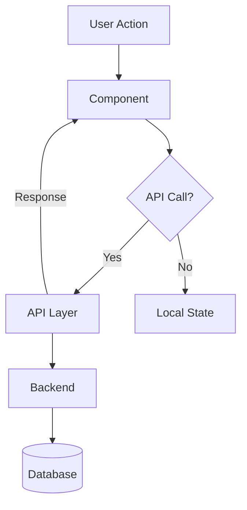

# Thiết kế Kỹ thuật: [Tên Feature]

**Phiên bản:** 1.0
**Ngày tạo:** [Ngày tháng]
**Trạng thái:** Draft / Ready / Implemented

---

## 1. Sơ đồ kiến trúc



---

## 2. Data Model

### 2.1 TypeScript Interfaces

```typescript
interface [ModelName] {
  field: type        // mô tả
}

const DEFAULT_[NAME]: [Type][] = []
```

### 2.2 Python Schemas (nếu có)

```python
class [SchemaName](BaseModel):
    field: str
```

### 2.3 Database Changes

| Action | Table | Change |
|--------|-------|--------|
| N/A | — | No database changes |

---

## 3. Component File Map

### 3.1 Files tạo mới

| File path | Export chính | Trách nhiệm |
|-----------|-------------|-------------|
| `apps/frontend/src/[path]/[file].tsx` | `ComponentName` | [Trách nhiệm] |

### 3.2 Files sửa đổi

| File path | Thay đổi |
|-----------|---------|
| `apps/frontend/src/[path]/[file].tsx` | [Thay đổi cụ thể] |

---

## 4. State Management

### 4.1 State Architecture

```typescript
const [state, setState] = useState<Type>(defaultValue)
const derived = useMemo(() => compute(state), [state])
```

### 4.2 State Flow

```
mount: state ← prop / DEFAULT
action: setState(update(prev, patch))
save: onCallback(state) + onClose()
unmount: state reset
```

---

## 5. API Specifications

### 5.1 [API Name]

| Property | Value |
|----------|-------|
| **Method** | `POST` |
| **Path** | `/api/v1/[resource]` |
| **Auth** | Required |

**Request:**
```json
{}
```

**Response (200):**
```json
{}
```

**Frontend:**
```typescript
const { mutate } = useMutation({ mutationFn: apiFunction })
```

---

## 6. Test Architecture

| File | Type | Covers |
|------|------|--------|
| `apps/frontend/tests/unit/[path]/[Component].test.tsx` | Unit | [Behaviors] |

**Key scenarios:**
```typescript
it('renders [N] items', () => {})
it('[button] calls [callback]', () => {})
it('disabling [A] clears [B]', () => {})
```

---

## 7. Dependencies

| Package | Version | Usage |
|---------|---------|-------|
| [package] | ^x.y | [Usage] |

---

## 8. Infrastructure & Security

### CSP

```javascript
// apps/frontend/next.config.mjs
"img-src 'self' data: blob: https://*.domain.com"
```

### Security Notes
- **Rate limiting:** [Yes / No — lý do]
- **Input validation:** [Validate gì, ở đâu]
- **Sensitive data:** [Cách xử lý nếu có]
