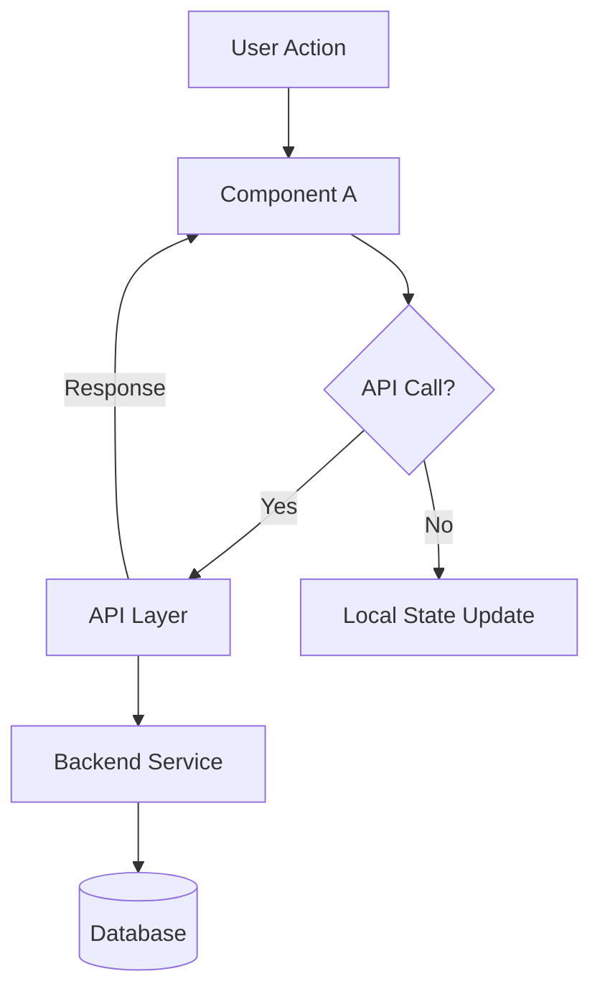
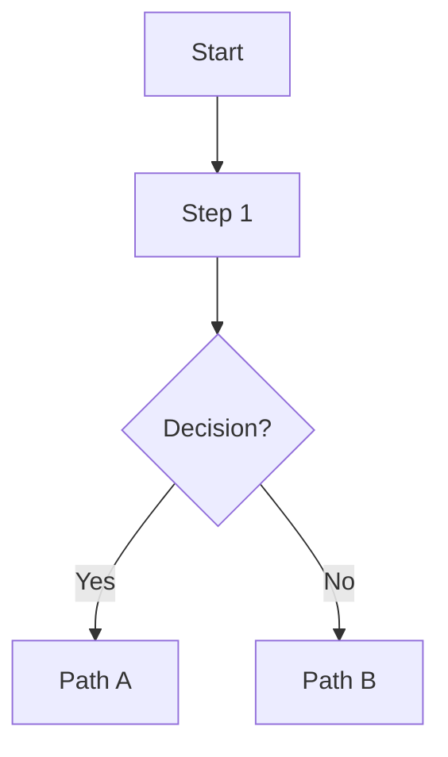
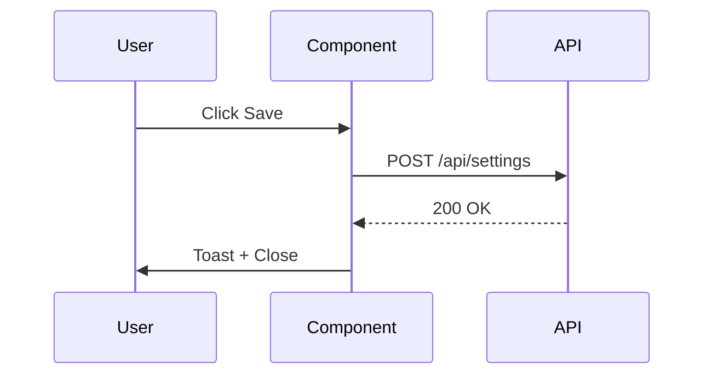

# Technical Guide — technical.md

Hướng dẫn viết `technical.md` từ CR + codebase. File này dành cho **Backend Developer, Frontend Developer, Tech Lead** — implementation-grade details.

---

## Nguyên tắc cốt lõi

1. **Update, không replace** — `02_technical.md` là living doc. Thêm sections mới, không xóa phần cũ.
2. **Code là truth** — Nếu CR spec khác code, document code thực tế và ghi note về deviation.
3. **File paths phải tồn tại** — Verify file path thực sự tồn tại trước khi viết vào docs. Nếu "cần tạo mới" → ghi rõ.
4. **Mermaid cho diagrams** — Dùng MermaidJS cho flow diagrams, không ASCII art.
5. **Types phải match code** — Copy TypeScript interfaces từ code, không paraphrase.

---

## Nguồn dữ liệu

| Section trong `technical.md` | Lấy từ đâu |
|------------------------------|------------|
| System Architecture | CR Section 3 (Component File Map) + codebase |
| Data Model | CR Section 2 + TypeScript interfaces trong code |
| Component File Map | CR Section 3 + verify file paths thực tế |
| State Management | CR Section 3.3 (State flow) + hooks trong code |
| API Specifications | CR Section 8 + backend routes |
| TDD / Test Patterns | CR Section 9 + test files trong codebase |
| Dependencies | package.json / pyproject.toml + CR Section 8 |
| Security | CR Section 7 (CSP) + infrastructure config |

---

## Template `technical.md`

````markdown
# Thiết kế Kỹ thuật: [Tên Feature]

**Phiên bản:** 1.0
**Ngày tạo:** [Ngày tháng]
**Trạng thái:** Draft / Ready / Implemented

---

## 1. Sơ đồ kiến trúc



> Thay bằng diagram thực tế của feature. Nếu không có API call → dùng component diagram.

---

## 2. Data Model

### 2.1 TypeScript Interfaces / Types

```typescript
// Copy trực tiếp từ code — không paraphrase
interface [ModelName] {
  field: string        // mô tả
  // ...
}

// Constants
const DEFAULT_[NAME]: [Type][] = [
  // ...
]
```

### 2.2 Python Schemas (nếu có backend changes)

```python
class [SchemaName](BaseModel):
    field: str
    # ...
```

### 2.3 Database Changes (nếu có)

| Action | Table | Change |
|--------|-------|--------|
| CREATE | `[table_name]` | New table: `(id, field1, field2, created_at)` |
| ALTER | `[table_name]` | Add column: `[column_name] [type] DEFAULT [value]` |
| N/A | — | No database changes in this feature |

---

## 3. Component File Map

### 3.1 Files tạo mới

| File path | Export chính | Trách nhiệm |
|-----------|-------------|-------------|
| `apps/frontend/src/[path]/[file].tsx` | `ComponentName`, `TypeName`, `CONST_NAME` | [Mô tả ngắn trách nhiệm] |

### 3.2 Files sửa đổi

| File path | Thay đổi cụ thể |
|-----------|-----------------|
| `apps/frontend/src/[path]/[file].tsx` | [Mô tả thay đổi — thêm prop, refactor function, ...] |
| `apps/frontend/src/[path]/globals.css` | Thêm CSS classes: [danh sách class] |
| `apps/frontend/next.config.mjs` | CSP: thêm `[domain]` vào `img-src` |

### 3.3 Migration Notes (nếu có breaking changes)

| Field cũ | Field mới | Migration |
|----------|-----------|-----------|
| `old_field: string` | `new_field: boolean` | Convert `"1"/"0"` → `true/false` |

---

## 4. State Management

### 4.1 State Architecture

```typescript
// Trong [ComponentName]
const [stateName, setStateName] = useState<[Type]>([defaultValue])

// Derived state — useMemo
const derivedValue = useMemo(() => 
  stateName.filter(c => c.condition).map(c => c.field).join(', '),
  [stateName]
)
```

### 4.2 State Flow

```
Initial mount:
  stateName ← prop hoặc DEFAULT_VALUE

User action [X]:
  setStateName(prev => update(prev, patch))
  → re-render với new state

Save success:
  onCallback(stateName)    // propagate to parent
  onClose()                // unmount → reset state
```

### 4.3 Draft Pattern (nếu component có internal draft)

- Component tạo internal draft copy từ prop khi mount
- Draft không affect parent state cho đến khi user click Lưu
- Hủy = discard draft = state parent không đổi
- Open/Close lại = draft reinitialize từ prop mới nhất

---

## 5. API Specifications

### 5.1 [API Name] — [Method] [Endpoint]

| Property | Value |
|----------|-------|
| **Method** | `POST` / `GET` / `PUT` / `DELETE` |
| **Path** | `/api/v1/[resource]/[action]` |
| **Auth** | Required (Bearer Token) / Not required |

**Request Body:**
```json
{
  "field_a": ["value1", "value2"],
  "field_b": { "key": "value" }
}
```

**Response — Success (200 OK):**
```json
{
  "status": "success",
  "data": {}
}
```

**Response — Error (4xx/5xx):**
```json
{
  "detail": "Error message"
}
```

**Frontend usage:**
```typescript
const { mutate } = useMutation({
  mutationFn: (payload) => apiFunction(payload),
  onSuccess: () => { /* ... */ },
  onError: (error) => { /* ... */ },
})
```

---

## 6. Test Architecture

### 6.1 Test Files

| File | Test type | Covers |
|------|-----------|--------|
| `apps/frontend/tests/unit/[path]/[Component].test.tsx` | Unit (Vitest) | [Component behaviors] |
| `apps/backend/tests/[path]/test_[module].py` | Integration (pytest) | [API endpoint behaviors] |

### 6.2 Key Test Scenarios

```typescript
// Render
it('renders [N] rows', () => { /* ... */ })

// Interaction  
it('"[Button]" calls [callback]', () => { /* ... */ })

// Dependency
it('disabling [A] clears [B] and [C]', () => { /* ... */ })
```

### 6.3 Test Selector Patterns

| Element | Selector |
|---------|---------|
| Checkbox | `screen.getByLabelText('[Type] [field]')` |
| Text input | `screen.getByPlaceholderText('[placeholder]')` |
| Button | `screen.getByRole('button', { name: /[text]/i })` |

---

## 7. Third-party Dependencies

| Dependency | Version | Usage |
|------------|---------|-------|
| `[package-name]` | `^x.y.z` | [Mô tả] |

**New dependencies cần install:**
```bash
# Frontend
pnpm add [package] --filter frontend

# Backend
uv add [package]
```

---

## 8. Infrastructure & Security

### 8.1 CSP (Content Security Policy)

File: `apps/frontend/next.config.mjs`

```javascript
// Thêm vào img-src directive:
"img-src 'self' data: blob: https://*.example.com"
```

**Lý do:** [Mô tả tại sao cần domain này — external images, CDN, etc.]

### 8.2 Environment Variables

| Variable | Required | Default | Mô tả |
|----------|---------|---------|-------|
| `[VAR_NAME]` | Yes / No | `[default]` | [Mô tả] |

### 8.3 Security Considerations

- **Rate limiting:** [Có / Không — lý do]
- **Input validation:** [Validate gì, ở đâu (frontend/backend)]
- **Sensitive data:** [Có field nào sensitive không — cách xử lý]
````

---

## Quy tắc viết Data Model

### Copy types từ code, không paraphrase

```typescript
// ❌ Sai — paraphrase làm mất precision
// CatalogColumnConfig gồm: field string, visible bool, ...

// ✅ Đúng — copy trực tiếp từ code
interface CatalogColumnConfig {
  field: string        // key trong ProductSearchStaging
  visible: boolean     // hiển thị field trên card/table
  searchable: boolean  // đưa vào search_fields khi gọi API
  preview: boolean     // render value dưới dạng ảnh
  alias: string        // label tùy chỉnh (rỗng = dùng placeholder)
}
```

### Verify file paths

Trước khi viết file path vào docs:
```bash
# Verify file tồn tại
ls apps/frontend/src/path/to/file.tsx

# Hoặc tìm file
find apps -name "component-name.tsx"
```

Nếu file chưa tồn tại → ghi `(cần tạo mới)` trong File Map.

---

## Quy tắc viết API Specifications

### Level of detail bắt buộc

**Quá vague:**
```
API: POST /api/v1/settings — lưu settings
```

**Đúng level:**
```
POST /api/v1/catalog/search-settings
Request: { visible_columns: string[], column_aliases: Record<string, string>, searchable_fields: string[] }
Response 200: { status: "success" }
Response 422: { detail: "Validation error" }
Frontend: useMutation với onSuccess → setColumns + refetch + toast
```

---

## Quy tắc MermaidJS

Dùng graph TD cho component/data flow:


Dùng sequenceDiagram cho API interactions:


---

## Checklist `technical.md`

```
[ ] Section 1: Có diagram phản ánh đúng architecture của feature
[ ] Section 2: TypeScript interfaces copy từ code (không paraphrase)
[ ] Section 2: Database changes rõ ràng hoặc "N/A - No DB changes"
[ ] Section 3: File paths đã verify tồn tại (hoặc ghi "cần tạo mới")
[ ] Section 3: Export names match với code
[ ] Section 4: State flow document đủ: mount, update, save, unmount
[ ] Section 4: Draft pattern document nếu component có internal state
[ ] Section 5: Mỗi API có: method + path + auth + request + response + frontend usage
[ ] Section 6: Test files paths tồn tại thực sự
[ ] Section 7: Dependencies verify trong package.json / pyproject.toml
[ ] Section 8: CSP changes nếu có external image domains
[ ] Không có placeholder "[điền vào]" — điền thực tế hoặc ghi "N/A"
```
